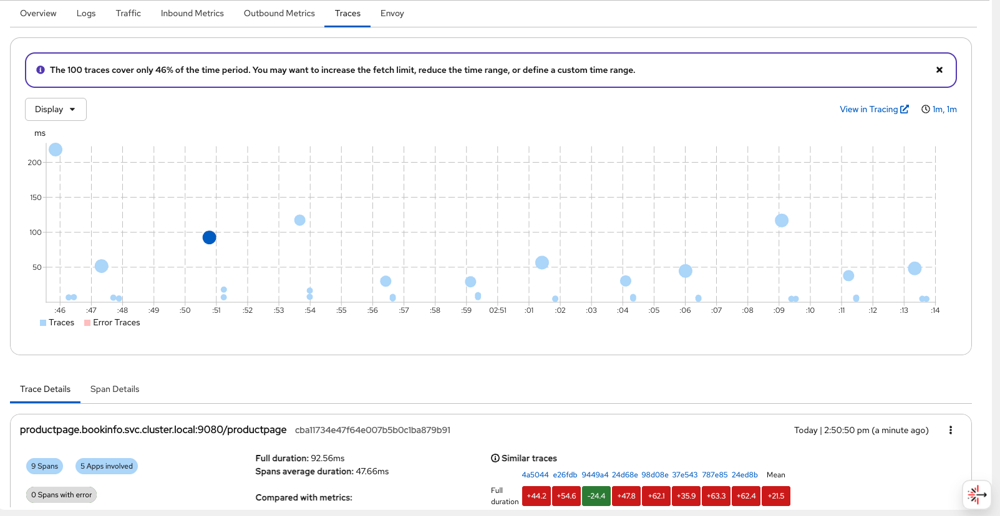

:icons: font
:source-highlighter: highlightjs
:highlightjs-theme: monokai
:sectnums:
:toc:
:toclevels: 4

== Despliegue de Service Mesh 3 con Gateway API y OpenTelemetry

Este directorio contiene los manifiestos de Argo CD y los charts Helm necesarios para desplegar un entorno de demostración completo en OpenShift:

* **OpenShift Service Mesh 3** (modo sidecar) con https://kubernetes.io/docs/concepts/services-networking/gateway/[Kubernetes Gateway API]
* Aplicación de ejemplo **Bookinfo**
* **Ingress gateway** basado en Gateway API
* Stack de **observabilidad**: Kiali, OpenTelemetry Collector, MinIO, Tempo, Loki, Grafana Alloy y Grafana

El despliegue se realiza mediante **OpenShift GitOps** (Argo CD). Los manifiestos `01`–`13` (más `05-grafana-operator`) definen las Applications de Argo CD que sincronizan los charts Helm desde Git.

[NOTE]
====
Kubernetes Gateway API viene incluida (y soportada) por defecto desde OpenShift 4.19. En versiones anteriores puede no estar instalada y no está soportada oficialmente porque es la versión de comunidad.
====

=== Requisitos previos

* Cluster OpenShift 4.16+ (probado en 4.21)
* Acceso de administrador de cluster (`cluster-admin`)
* Cliente `oc` autenticado contra el cluster
* Cliente `helm` (v3)
* Acceso a los catálogos `redhat-operators` y `community-operators` (OperatorHub)
* Repositorio Git accesible desde el cluster (por defecto: `https://github.com/nicknas/service-mesh-3-demo.git`, rama `main`)

[IMPORTANT]
====
Si vas a usar tu propio fork, actualiza el campo `spec.source.repoURL` en todos los manifiestos `0X-*.yaml` antes de aplicarlos.
====

=== Arquitectura del despliegue

image::images/service-mesh-gw-api.png.excalidraw.png[]

Los componentes se organizan en Applications de Argo CD independientes. El orden de aplicación es importante en el arranque inicial:

[cols="1,2,1", options="header"]
|===
| Orden | Application de Argo CD | Manifest

| Bootstrap | _(manual)_ | Operador OpenShift GitOps
| 1 | `service-mesh3-operator` | `01-service-mesh3-operator.yaml`
| 2 | `kiali-operator` | `02-kiali-operator.yaml`
| 3 | `otel-operator` | `03-otel-operator.yaml`
| 4 | `tempo-operator` | `04-tempo-operator.yaml`
| 5 | `cluster-observability-operator` | `05-cluster-observability-operator.yaml`
| 5b | `grafana-operator` | `05-grafana-operator.yaml`
| 6 | `sm3-control-plane` | `06-control-plane.yaml`
| 7 | `bookinfo-application` | `07-bookinfo-application.yaml`
| 8 | `istio-ingressgateway` | `08-istio-ingress-gateway.yaml`
| 9 | `bookinfo-gateway` | `09-bookinfo-gateway.yaml`
| 10 | `minio` | `10-minio.yaml`
| 11 | `observability` | `11-observability.yaml`
| 12 | `logging` | `13-logging.yaml`
| 13 | `grafana` | `12-grafana.yaml`
|===

[NOTE]
====
La Application `minio` debe sincronizarse **antes** que `observability`, ya que Tempo necesita el almacenamiento de objetos S3 que proporciona MinIO.

La Application `logging` debe sincronizarse **antes** que `grafana`, ya que el datasource de Loki apunta al servicio desplegado en `logging-system`.

La Application `grafana-operator` debe sincronizarse con el resto de operadores (antes del control plane y de la instancia Grafana).

La Application `grafana` debe sincronizarse **después** de `grafana-operator`, `observability` y `logging`, ya que el operador debe estar listo y los datasources de Prometheus, Tempo y Loki deben existir.
====

=== Diferencias con la API clásica de Istio

* **Ingress gateway:** ya no se crea mediante un `Deployment` dedicado; se despliega un objeto `Gateway` del API `gateway.networking.k8s.io`.
* **Enrutamiento:** los `VirtualService` se sustituyen por `HTTPRoute` (o `GRPCRoute`). También existen `TCPRoute`, `TLSRoute` y `UDPRoute`, pero de momento son experimentales.
* **Otros recursos de Istio** (`DestinationRule`, `ServiceEntry`, etc.) siguen siendo aplicables.

[NOTE]
====
Los `VirtualService` todavía están soportados en Service Mesh 3, pero la recomendación es migrar a `HTTPRoute`. Existe una https://github.com/kubernetes-sigs/ingress2gateway[herramienta] para automatizar esta conversión.
====

== Instalación paso a paso

=== Paso 1: Instalar el operador OpenShift GitOps (bootstrap)

Argo CD no puede gestionarse a sí mismo en el arranque inicial. El operador GitOps se instala manualmente con el chart Helm `helm-charts/openshift-gitops-operator`:

[source,bash]
----
cd service-mesh-deployments/v3-gw-api-otel

helm template openshift-gitops-operator helm-charts/openshift-gitops-operator \
  --show-only templates/namespace.yaml \
  --show-only templates/operator-group.yaml \
  --show-only templates/subscription.yaml \
  | oc apply -f -
----

Espera a que el operador esté listo y se cree la instancia de Argo CD:

[source,bash]
----
# CSV del operador en estado Succeeded
oc get csv -n openshift-gitops-operator

# Pods de Argo CD en ejecución
oc get pods -n openshift-gitops
oc get argocd -n openshift-gitops
----

[WARNING]
====
No uses `helm install` para el chart `openshift-gitops-operator` si el operador ya ha creado la instancia `ArgoCD`: el CR es propiedad del operador y Helm fallará por conflictos de ownership. Usa siempre `helm template | oc apply` para el bootstrap.
====

=== Paso 2: Configurar RBAC de Argo CD

Por defecto, solo los administradores de cluster pueden ver las Applications en la UI de GitOps. Aplica la configuración RBAC del chart para conceder acceso de lectura a usuarios autenticados:

[source,bash]
----
helm template openshift-gitops-operator helm-charts/openshift-gitops-operator \
  --show-only templates/argocd.yaml \
  --api-versions=argoproj.io/v1beta1 \
  | oc apply -f -
----

Comprueba que la política por defecto es `role:readonly`:

[source,bash]
----
oc get configmap argocd-rbac-cm -n openshift-gitops \
  -o jsonpath='{.data.policy\.default}{"\n"}'
----

=== Paso 3: Aplicar las Applications de Argo CD

Aplica los manifiestos en orden numérico:

[source,bash]
----
for f in 0{1..9}-*.yaml 10-minio.yaml 11-observability.yaml 13-logging.yaml 12-grafana.yaml; do
  echo "Aplicando $f..."
  oc apply -f "$f"
done
----

Comprueba el estado de las Applications:

[source,bash]
----
oc get applications -n openshift-gitops \
  -o custom-columns='NAME:.metadata.name,SYNC:.status.sync.status,HEALTH:.status.health.status'
----

=== Paso 4: Permisos del application-controller

El controlador de Argo CD necesita permisos de cluster para crear recursos de Service Mesh, Gateway API y operadores. Crea el `ClusterRoleBinding` manualmente (no está gestionado por Git):

[source,bash]
----
oc create clusterrolebinding openshift-gitops-argocd-cluster-admin \
  --clusterrole=cluster-admin \
  --serviceaccount=openshift-gitops:openshift-gitops-argocd-application-controller
----

[IMPORTANT]
====
Este paso es necesario en cada instalación limpia. Sin él, las Applications quedarán en `OutOfSync` con errores `forbidden` al sincronizar CRDs de Istio, Sail Operator o Gateway API.
====

=== Paso 5: Esperar la sincronización

Todas las Applications deben quedar en `Synced` / `Healthy`. Las Applications de operadores pueden mostrar brevemente `Degraded` en Argo CD aunque el CSV de OLM esté en `Succeeded`; es un falso positivo habitual.

Comprueba también el control plane, MinIO y logging:

[source,bash]
----
oc get istio default -n istio-system
oc get pods -n tracing-system
oc get tempostack tempo -n tracing-system
oc get pods -n logging-system
----

=== Paso 6: Reiniciar Bookinfo para inyectar sidecars

Los pods de Bookinfo deben crearse **después** de que el control plane y el webhook de inyección estén listos. Si los pods muestran `1/1` en lugar de `2/2`, reinicia los deployments:

[source,bash]
----
oc rollout restart deployment -n bookinfo
oc rollout status deployment -n bookinfo --timeout=120s
oc get pods -n bookinfo
----

Cada pod debe mostrar `2/2 Running` (aplicación + `istio-proxy`).

== Componentes desplegados

[[operators-olm]]
=== Operadores OLM (Applications 01–05 y 05-grafana-operator)

Los operadores se instalan vía Operator Lifecycle Manager (OLM). Cada uno tiene un chart Helm con `Subscription` y, salvo el Cluster Observability Operator, una versión fijada (`startingCSV`) en su `values.yaml`.

[NOTE]
====
Si el catálogo del cluster no incluye el CSV exacto, ajusta `startingCSV` en el chart correspondiente o deja que OLM instale la última del canal. Comprueba disponibilidad con:

[source,bash]
----
oc get packagemanifest <operator-name> -n openshift-marketplace -o jsonpath='{.status.channels[*].currentCSV}{"\n"}'
----
====

[cols="2,2,3", options="header"]
|===
| Operador (OLM) | Catálogo | CSV / canal

| **OpenShift GitOps**
| `redhat-operators`
| `openshift-gitops-operator.v1.21.3` — canal `latest`

| **OpenShift Service Mesh 3** (`servicemeshoperator3`)
| `redhat-operators`
| `servicemeshoperator3.v3.1.6` — canal `stable`

| **Kiali Operator**
| `redhat-operators`
| `kiali-operator.v2.22.1` — canal `stable`

| **OpenTelemetry Operator**
| `redhat-operators`
| `opentelemetry-operator.v0.144.0-1` — canal `stable`

| **Tempo Operator**
| `redhat-operators`
| `tempo-operator.v0.21.0-3` — canal `stable`

| **Cluster Observability Operator**
| `redhat-operators`
| Canal `stable` (sin CSV fijado; última versión del catálogo)

| **Grafana Operator**
| `community-operators`
| `grafana-operator.v5.24.0` — canal `v5`
|===

==== Instancias gestionadas por operador

Estos componentes no son operadores OLM; usan CRs de operadores ya instalados, desplegados por charts Helm adicionales:

[cols="2,3,2", options="header"]
|===
| Componente | Chart / CR | Operador que lo gestiona

| **Istio control plane** (Sail)
| `helm-charts/sm3-control-plane` → `Istio`
| Service Mesh 3 Operator

| **Kiali**
| `helm-charts/observability/charts/kiali` → `Kiali`
| Kiali Operator

| **TempoStack**
| `helm-charts/observability/charts/tempostack` → `TempoStack`
| Tempo Operator

| **OpenTelemetry Collector**
| `helm-charts/observability/charts/otel-collector` → `OpenTelemetryCollector`
| OpenTelemetry Operator

| **Grafana** (instancia demo)
| `helm-charts/grafana` → `Grafana`, `GrafanaDatasource`, `GrafanaDashboard`
| Grafana Operator
|===

==== Orden de instalación de operadores

Los operadores deben estar en estado `Succeeded` antes de sincronizar las Applications que crean CRs (`sm3-control-plane`, `observability`, `grafana`, etc.):

[source,bash]
----
for f in \
  01-service-mesh3-operator.yaml \
  02-kiali-operator.yaml \
  03-otel-operator.yaml \
  04-tempo-operator.yaml \
  05-cluster-observability-operator.yaml \
  05-grafana-operator.yaml; do
  oc apply -f "$f"
done

oc get csv -A | grep -E 'servicemesh|kiali|opentelemetry|tempo|cluster-observability|grafana'
----

==== Verificación rápida de operadores

[source,bash]
----
oc get subscription -A | grep -E 'servicemesh|kiali|opentelemetry|tempo|cluster-observability|grafana|gitops'

oc get pods -n openshift-operators -l 'operators.coreos.com/grafana-operator.openshift-operators'
oc get pods -n openshift-operators -l 'operators.coreos.com/kiali-operator.openshift-operators'
oc get pods -n openshift-tempo-operator
oc get pods -n openshift-cluster-observability-operator
----

[NOTE]
====
* **Grafana Operator** proviene de `community-operators`, no de `redhat-operators`. Requiere acceso al catálogo community en OperatorHub.
* **Cluster Observability Operator** habilita Perses y plugins de observabilidad en consola (`Observe → Dashboards`). No sustituye a Grafana en esta demo.
* Los subcharts de observabilidad (`kiali`, `otel-collector`, `tempostack`) son locales (`file://`); no se empaquetan como `.tgz` en el repositorio.
* Si has instalado y desinstalado Service Mesh 2 previamente y la instalación del operador de Service Mesh 3 se queda bloqueada, elimina los CRDs antiguos de `sailoperator` que hayan quedado en el cluster.
====

=== Control plane (Application 06)

El manifest `06-control-plane.yaml` despliega:

* CR `Istio` en el namespace `istio-system` (versión `v1.30.3` por defecto)
* CR `IstioCNI` en el namespace `istio-cni`
* Objeto `IstioRevision` generado automáticamente por el operador

Configuración en `helm-charts/sm3-control-plane/values.yaml`.

=== Aplicación Bookinfo (Application 07)

El manifest `07-bookinfo-application.yaml`:

* Crea el namespace `bookinfo` con las etiquetas necesarias para el mesh:
+
[source,yaml]
----
labels:
  istio-discovery: enabled
  istio-injection: enabled
----
* Despliega la aplicación https://istio.io/latest/docs/examples/bookinfo/[bookinfo]
* Configura un `PodMonitor` para métricas de los sidecars `istio-proxy` (incluye métricas de aplicación fusionadas por Istio cuando el pod declara anotaciones `prometheus.io/*`; ver `productpage-v1` en el chart bookinfo-application)

[WARNING]
====
Si el CR `Istio` no se llama `default`, la etiqueta `istio-injection=enabled` no funcionará. En ese caso usa:
[source,yaml]
----
istio.io/rev: <nombre_cr_istio>
----
====

=== Ingress gateway (Application 08)

El manifest `08-istio-ingress-gateway.yaml`:

* Crea el namespace `istio-ingress`
* Despliega un `Gateway` usando Gateway API (`gatewayClassName: istio`)
* Crea una ruta OpenShift para pruebas con el formato:
+
----
https://bookinfo.<cluster-hostname>
----

[IMPORTANT]
====
Debes usar `istio` como `gatewayClassName` para que Istio gestione el gateway creado.
====

=== Gateway de Bookinfo (Application 09)

El manifest `09-bookinfo-gateway.yaml`:

* Crea el gateway específico de Bookinfo en `istio-ingress`
* Crea el `HTTPRoute` en el namespace `bookinfo` para enrutar el tráfico externo a `productpage`

Comprueba el acceso (la ruta usa terminación TLS en el edge):

[source,bash]
----
curl -sk https://bookinfo.<cluster-hostname>/api/v1/products | jq
curl -sk -o /dev/null -w "%{http_code}\n" https://bookinfo.<cluster-hostname>/productpage
----

=== MinIO (Application 10)

El manifest `10-minio.yaml` despliega de forma independiente el almacenamiento de objetos S3 que Tempo necesita:

* Namespace `tracing-system`
* Deployment y servicio MinIO
* PVC de persistencia
* Secret con credenciales S3
* Job de creación del bucket `tempo`

Chart: `helm-charts/minio`

Los recursos usan *sync waves* de Argo CD para coordinar el orden de creación (namespace → PVC/deployment/secret → bucket job).

=== Observabilidad (Application 11)

El manifest `11-observability.yaml` despliega:

* Instancia de **Kiali** y consola OSSM
* **OpenTelemetry Collector** para recopilar trazas y métricas del mesh
* **TempoStack** para almacenar trazas (usa el Secret de MinIO creado por la Application anterior)
* Plugin de observabilidad distribuida en la consola de OpenShift
* `ServiceMonitor` de istiod y `PodMonitor` de sidecars en `bookinfo`

Chart: `helm-charts/observability`

image::images/sm3-otel-tempo.excalidraw.png[]

=== Logging (Application 13)

El manifest `13-logging.yaml` despliega recolección y almacenamiento de **logs de aplicación** de Bookinfo. No usa el operador de logging de OpenShift (ClusterLogForwarder / LokiStack); es un stack autónomo integrado con Grafana.

Chart: `helm-charts/logging`

==== Arquitectura

[source]
----
Pods Bookinfo (stdout/stderr)
        │
        ▼
Grafana Alloy  ──(API Kubernetes: pods/log)──►  filtra namespace bookinfo
        │                                        etiquetas: app, version, pod
        ▼
Loki (logging-system)  ──►  PVC 5 GiB, retención 7 días
        │
        ▼
Grafana (datasource Loki + dashboard Bookinfo — Logs)
----

==== Componentes desplegados

[cols="1,2", options="header"]
|===
| Recurso | Descripción

| Namespace `logging-system` | Aislamiento del stack de logs
| **Loki** (`logging-loki`) | Almacén de logs (modo monolito, filesystem)
| **Grafana Alloy** (`logging-alloy`) | Colector que lee logs de pods vía API de Kubernetes (sin DaemonSet privilegiado)
| Service `logging` | Endpoint interno `:3100` para consultas y push
|===

==== Qué se recoge (y qué no)

* **Sí:** stdout/stderr de los contenedores de aplicación (`productpage`, `reviews`, `details`, `ratings`) y access logs de Envoy en `istio-proxy` (namespace `bookinfo`).
* **No:** contenedor `istio-validation` (filtrado en Alloy).
* **No:** operador de logging de plataforma OpenShift (ClusterLogForwarder / LokiStack).

[NOTE]
====
* `details` y `ratings` registran cada petición HTTP en la app (siempre visibles con tráfico).
* `productpage` (Gunicorn) solo registra peticiones si se habilita `--access-logfile -` en el deployment.
* `reviews` (Open Liberty) no escribe una línea por petición en el contenedor de aplicación; el tráfico se ve en los access logs de `istio-proxy` del pod.
====

==== Etiquetas en Loki

Alloy añade etiquetas a partir de los metadatos del pod:

[cols="1,2", options="header"]
|===
| Etiqueta | Origen

| `namespace` | Namespace del pod (`bookinfo`)
| `app` | Etiqueta Kubernetes `app` (`productpage`, `reviews`, …)
| `version` | Etiqueta `version` del pod (`v1`, `v2`, `v3`)
| `service_name` | Copia de `app` (nombre legible en Grafana Explore)
| `pod` / `container` | Identificador del pod y contenedor
|===

En Grafana Explore, agrupa por `service_name` o filtra con LogQL:

[source,logql]
----
{namespace="bookinfo", app="productpage"}
{namespace="bookinfo", app="reviews", version="v2"}
----

==== Cambios en Bookinfo y mesh (visibilidad de logs)

* **productpage:** el chart sobrescribe el comando de Gunicorn con `--access-logfile -` para enviar el access log a stdout.
* **reviews:** Open Liberty no registra cada petición en stdout; se habilitan access logs de Envoy (`Telemetry` `access-logs` + `meshConfig.accessLogFile: /dev/stdout`) y Alloy recoge el contenedor `istio-proxy`.
* **LOG_DIR:** no se usa en reviews (los logs de Liberty iban a ficheros bajo `/tmp/logs`, invisibles para el colector de Kubernetes).

==== Configuración de Alloy

El fichero `helm-charts/logging/templates/alloy-configmap.yaml` define:

. *discovery.kubernetes*: pods en `bookinfo` con `app in (productpage, reviews, details, ratings)`.
. *discovery.relabel*: mapea `namespace`, `app`, `version`, `pod`, `container` y `service_name`.
. *loki.source.kubernetes*: transmite los logs al pipeline.
. *loki.process*: descarta solo el contenedor `istio-validation`.
. *loki.write*: envía a `http://logging.logging-system.svc.cluster.local:3100/loki/api/v1/push`.

==== Verificación

[source,bash]
----
oc get pods -n logging-system
oc exec -n logging-system deploy/logging-loki -- \
  wget -qO- 'http://localhost:3100/loki/api/v1/label/app/values'
# Debe listar: productpage, reviews, details, ratings
----

=== Grafana Operator (Application 05-grafana-operator)

Instala el **Grafana Operator** desde `community-operators` (canal `v5`, CSV `grafana-operator.v5.24.0`). Chart: `helm-charts/grafana-operator`. Ver la tabla de operadores OLM en <<operators-olm>>.

=== Grafana (Application 12)

El manifest `12-grafana.yaml` despliega la instancia de Grafana mediante CRs del operador:

* Namespace `grafana-system`
* CR `Grafana` con persistencia (PVC), ruta OpenShift y versión de imagen configurable
* CRs `GrafanaDatasource`: **Prometheus** (Thanos Querier), **Tempo** (tenant `bookinfo`) y **Loki** (`logging-system`)
* CRs `GrafanaDashboard` en carpeta *Bookinfo*:
** *Bookinfo — Escenario OK* (queries Q1–Q8 del cheat sheet)
** *Bookinfo — Escenario Fallo* (queries Q9–Q13; ratings caído)
** *Bookinfo — Logs* (panel de logs con filtros por servicio y versión)

La integración Tempo → Loki (`tracesToLogs`) permite saltar desde una traza a logs del mismo periodo en el namespace `bookinfo`.

Chart: `helm-charts/grafana`

Credenciales por defecto (demo): usuario `admin`, contraseña `grafana` (configurable en `helm-charts/grafana/values.yaml` → `spec.config.security` del CR `Grafana`).

Acceso:

[source,bash]
----
oc get route -n grafana-system -o jsonpath='https://{.items[0].spec.host}{"\n"}'
oc get grafana -n grafana-system
----

==== Integración de Kiali con Tempo (pestaña Traces)
[[kiali-traces]]

Por defecto, el CR de Kiali solo configura Prometheus para métricas. Sin `external_services.tracing`, Kiali no sabe dónde consultar trazas y la pestaña *Traces* no aparece en workloads ni aplicaciones, aunque el flujo de tracing (Istio → OTel Collector → Tempo) esté funcionando.

La configuración se define en `helm-charts/observability/charts/kiali/templates/kiali.yaml` y sus valores en `helm-charts/observability/charts/kiali/values.yaml`.

===== Bloque `external_services.tracing`

[source,yaml]
----
tracing:
  enabled: true
  provider: tempo
  use_grpc: false
  internal_url: https://tempo-tempo-gateway.tracing-system.svc.cluster.local:8080/api/traces/v1/bookinfo/tempo
  external_url: https://tempo-tempo-gateway-tracing-system.apps.<cluster-domain>/api/traces/v1/bookinfo/search
  health_check_url: https://tempo-tempo-gateway.tracing-system.svc.cluster.local:8080/api/traces/v1/bookinfo/tempo/api/echo
  auth:
    ca_file: /var/run/secrets/kubernetes.io/serviceaccount/service-ca.crt
    type: bearer
    use_kiali_token: true
  tempo_config:
    name: tempo
    namespace: tracing-system
    tenant: bookinfo
    url_format: jaeger
----

[cols="1,3", options="header"]
|===
| Campo | Descripción

| `enabled` | Activa la integración con el backend de tracing.
| `provider: tempo` | Indica que el backend es Tempo (Red Hat OpenShift distributed tracing platform).
| `internal_url` | URL interna que Kiali usa para *consultar* trazas. Es imprescindible para mostrar la pestaña *Traces* integrada en la UI.
| `external_url` | URL del enlace *View in Tracing* hacia la consola Jaeger expuesta por el gateway de Tempo.
| `health_check_url` | Endpoint `/api/echo` que Kiali usa para comprobar que Tempo responde.
| `auth` | Autenticación HTTPS con el token del ServiceAccount de Kiali. Necesario en OpenShift con Tempo en modo multitenancy (`openshift`).
| `tempo_config.tenant` | Debe coincidir con el `tenantName` definido en el TempoStack (`bookinfo` en este ejemplo).
| `tempo_config.url_format: jaeger` | Formato de los enlaces externos hacia la UI Jaeger del gateway.
|===

[IMPORTANT]
====
`internal_url` habilita la pestaña *Traces* dentro de Kiali.
`external_url` solo sirve para el enlace externo *View in Tracing*. Sin `internal_url`, Kiali redirige fuera pero no muestra trazas en su propia UI.
====

===== URLs generadas automáticamente

El fichero `helm-charts/observability/charts/kiali/templates/_helpers.tpl` construye las URLs a partir del TempoStack desplegado:

* **Gateway interno:** `tempo-tempo-gateway.tracing-system.svc.cluster.local:8080`
* **Tenant:** `bookinfo` (definido en `tempostack.yaml`)
* **Ruta externa:** `tempo-tempo-gateway-tracing-system.apps.<cluster-domain>`

Si despliegas en otro cluster, actualiza `tracing.clusterDomain` en `helm-charts/observability/charts/kiali/values.yaml`:

[source,yaml]
----
tracing:
  clusterDomain: apps.<tu-cluster>.<dominio>
----

===== Permisos RBAC

En modo multitenancy de Tempo (`spec.tenants.mode: openshift`), el gateway valida permisos por tenant. El ServiceAccount `kiali-service-account` se añade al `ClusterRoleBinding` `tempostack-traces-reader` (`helm-charts/observability/charts/tempostack/templates/cluster-role-binding.yaml`) para que Kiali pueda leer trazas del tenant `bookinfo`.

===== Flujo de trazas

. Istio genera spans (Telemetry CR con provider `otel`, sampling al 100 %).
. El OpenTelemetry Collector los reenvía a Tempo vía OTLP.
. Tempo los almacena en MinIO.
. Kiali consulta Tempo mediante `internal_url` y muestra la pestaña *Traces* en workloads y aplicaciones.

==== Verificación de la pestaña Traces

. Genera tráfico con `./utils/generate-traffic.sh 30`.
. Abre Kiali → *Workloads* → selecciona un workload de `bookinfo` (por ejemplo `productpage`).
. Comprueba que aparece la pestaña *Traces* con el scatterplot de spans.

Si no aparece, verifica:

[source,bash]
----
# Kiali tiene tracing habilitado
oc get kiali kiali -n istio-system \
  -o jsonpath='{.spec.external_services.tracing.enabled}{" "}{.spec.external_services.tracing.internal_url}{"\n"}'

# TempoStack y gateway en ejecución
oc get tempostack tempo -n tracing-system
oc get pods -n tracing-system -l app.kubernetes.io/component=gateway
----

== Generación de tráfico y verificación

=== Script de tráfico externo

El script `utils/generate-traffic.sh` genera tráfico HTTPS contra los endpoints `/productpage` y `/api/v1/products`.

Configura el hostname de tu cluster en el script:

[source,bash]
----
HOSTNAME=bookinfo.apps.<tu-cluster>.<dominio>
----

Ejecución:

[source,bash]
----
./utils/generate-traffic.sh 30
----

Una ejecución correcta muestra códigos `200/200` en cada iteración.

=== Tráfico interno al cluster

En `utils/internal-traffic/` hay un Dockerfile y manifiestos para desplegar un generador de tráfico dentro del cluster. Consulta `utils/README.adoc` para más detalles.

=== Kiali

Tras generar tráfico, abre Kiali desde la consola de OpenShift (sección Service Mesh) o la ruta del operador. Deberías ver:

* El grafo de tráfico de Bookinfo con el ingress `istio-ingress-istio` (Gateway API).
* La pestaña *Traces* en el detalle de cada workload, con spans recopilados desde Tempo (ver <<kiali-traces>>).

image::images/trafico-kiali.png[Grafo de tráfico de Bookinfo en Kiali]

[NOTE]
====
No hagas scrape directo de los puertos de aplicación de Bookinfo (`:9080/metrics`) mediante un `ServiceMonitor` o un segundo endpoint en el `PodMonitor`: genera tráfico fantasma `unknown → service` en Kiali.

Para métricas de aplicación usa *metrics merging* de Istio: declara `prometheus.io/scrape`, `prometheus.io/port` y `prometheus.io/path` en el pod (como en `productpage-v1`); el `istio-agent` scrapea la app dentro del pod y expone todo en `/stats/prometheus` del sidecar. Prometheus solo necesita el `PodMonitor` del chart de observabilidad, que scrapea `istio-proxy`.
====

== Accesos útiles

[cols="1,2"]
|===
| Recurso | URL / comando

| Bookinfo (productpage) | `https://bookinfo.<cluster-hostname>/productpage`
| Argo CD (GitOps) | Consola OpenShift → Operadores → OpenShift GitOps, o ruta `openshift-gitops-server-openshift-gitops.apps.<cluster-hostname>`
| Kiali | Consola OpenShift → Service Mesh → Kiali
| Grafana | `oc get route grafana -n grafana-system`
| Logs (Loki API) | `http://logging.logging-system.svc.cluster.local:3100` (interno)
| Trazas (Tempo / Jaeger UI) | Ruta del gateway de Tempo en `tracing-system`
|===

== Charts Helm de referencia

[cols="1,2"]
|===
| Application | Chart

| `service-mesh3-operator` | `helm-charts/sm3-operator`
| `kiali-operator` | `helm-charts/kiali-operator`
| `otel-operator` | `helm-charts/otel-operator`
| `tempo-operator` | `helm-charts/tempo-operator`
| `cluster-observability-operator` | `helm-charts/cluster-observability-operator`
| `grafana-operator` | `helm-charts/grafana-operator`
| `sm3-control-plane` | `helm-charts/sm3-control-plane`
| `bookinfo-application` | `helm-charts/bookinfo-application`
| `istio-ingressgateway` | `helm-charts/istio-ingressgateway`
| `bookinfo-gateway` | `helm-charts/bookinfo-gateway`
| `minio` | `helm-charts/minio`
| `observability` | `helm-charts/observability`
| `logging` | `helm-charts/logging`
| `grafana` | `helm-charts/grafana`
| Bootstrap GitOps (manual) | `helm-charts/openshift-gitops-operator`
|===

== Desinstalación completa

Para eliminar todo el entorno de demostración y dejar el cluster limpio:

[source,bash]
----
# 1. Eliminar Applications de Argo CD
oc delete applications --all -n openshift-gitops --wait=true

# 2. Eliminar CRs de mesh y observabilidad
oc delete istio --all -n istio-system --ignore-not-found
oc delete istiocni --all -n istio-cni --ignore-not-found
oc delete kiali --all -n istio-system --ignore-not-found
oc delete opentelemetrycollector --all -n istio-system --ignore-not-found
oc delete tempostack --all -n tracing-system --ignore-not-found
oc delete grafana,grafanadatasource,grafanadashboard --all -n grafana-system --ignore-not-found

# 3. Revertir RBAC de GitOps al valor por defecto
oc patch argocd openshift-gitops -n openshift-gitops --type merge \
  -p '{"spec":{"rbac":{"defaultPolicy":"","policy":"g, system:cluster-admins, role:admin\ng, cluster-admins, role:admin\n","scopes":"[groups]"}}}'

# 4. Eliminar ClusterRoleBinding manual
oc delete clusterrolebinding openshift-gitops-argocd-cluster-admin --ignore-not-found

# 5. Desinstalar operadores (subscriptions y CSVs)
oc delete subscription openshift-gitops-operator -n openshift-gitops-operator --ignore-not-found
oc delete subscription servicemesh3-operator kiali-operator opentelemetry-operator grafana-operator \
  -n openshift-operators --ignore-not-found
oc delete subscription tempo-operator -n openshift-tempo-operator --ignore-not-found
oc delete subscription cluster-observability-operator \
  -n openshift-cluster-observability-operator --ignore-not-found

# 6. Eliminar GitopsService y ArgoCD CR
oc delete gitopsservice cluster --ignore-not-found
oc delete argocd openshift-gitops -n openshift-gitops --ignore-not-found

# 7. Eliminar namespaces de demo
for ns in bookinfo istio-ingress istio-system istio-cni tracing-system logging-system grafana-system \
  openshift-gitops-operator openshift-tempo-operator \
  openshift-cluster-observability-operator openshift-gitops; do
  oc delete namespace "$ns" --ignore-not-found --wait=false
done
----

Si el namespace `openshift-gitops` queda en `Terminating`, elimina los finalizers del CR `ArgoCD`:

[source,bash]
----
oc patch argocd openshift-gitops -n openshift-gitops \
  -p '{"metadata":{"finalizers":[]}}' --type=merge
oc delete namespace openshift-gitops --ignore-not-found
----

== Problemas conocidos

* **Applications en `OutOfSync` con `forbidden`:** falta el `ClusterRoleBinding` del paso 4.
* **Pods de Bookinfo sin sidecar (`1/1`):** reinicia los deployments tras sincronizar el control plane.
* **MinIO bloqueado en sync:** la Application `minio` debe aplicarse antes que `observability`. El PVC y el Deployment comparten sync-wave `1` para evitar bloqueos con almacenamiento `WaitForFirstConsumer`.
* **Grafana sin dashboard de logs o sin datasource Loki:** sincroniza la Application `logging` antes que `grafana`. Evita `ApplyOutOfSyncOnly=true` en la Application de Grafana (el Deployment debe montar el ConfigMap `grafana-dashboard-bookinfo-logs`).
* **Grafana sin logs de productpage/reviews:** genera tráfico (`curl -L …/productpage`); sincroniza apps `bookinfo-application`, `sm3-control-plane`, `logging` y `grafana`. En el dashboard usa **Container → All** o filtra `container="istio-proxy"` para reviews.
* **Operadores `Degraded` en Argo CD:** revisa el CSV en OLM; si está `Succeeded`, puedes ignorar el estado en Argo CD.
* **Tráfico HTTP en lugar de HTTPS:** el ingress usa terminación TLS en el edge; el script `generate-traffic.sh` usa `https://`.
