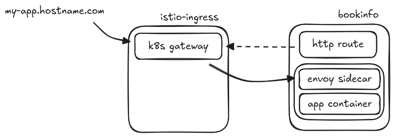
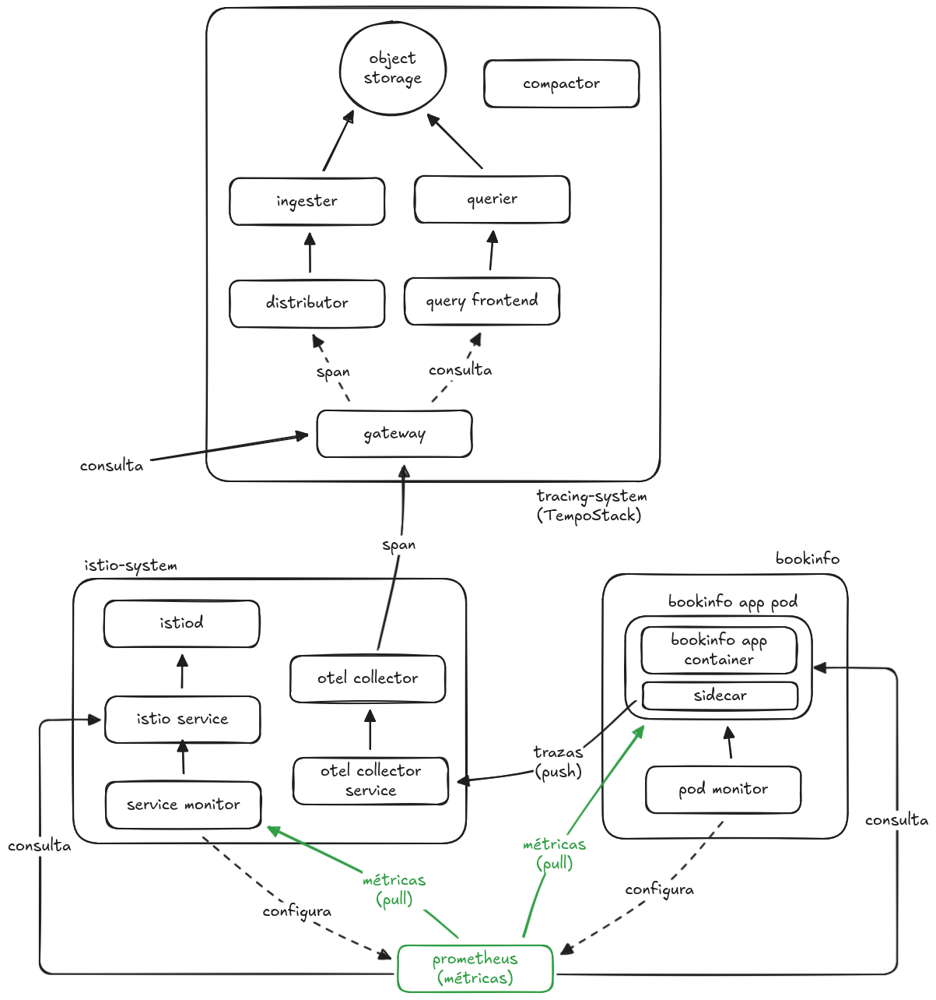
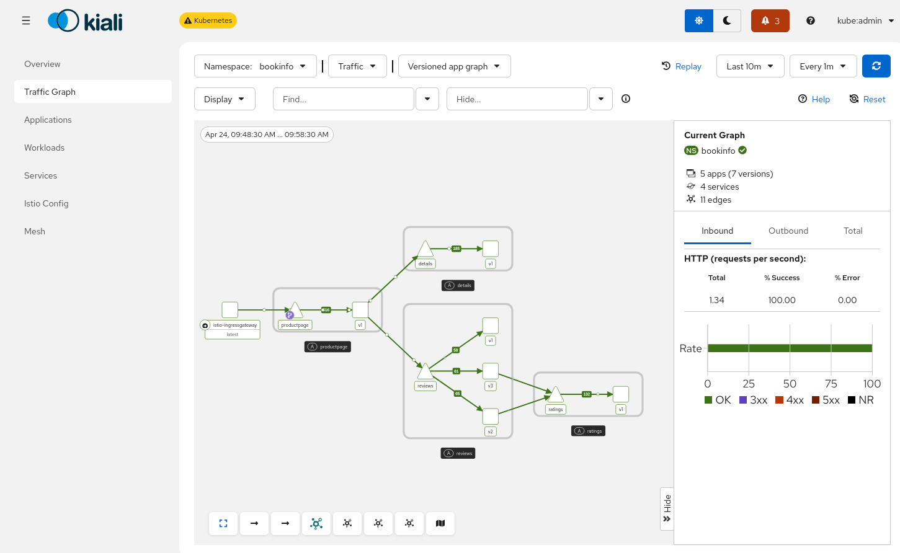

:icons: font
:source-highlighter: highlightjs
:highlightjs-theme: monokai
:sectnums:
:toc:
:toclevels: 4

== Despliegue de Service Mesh 3 con Gateway API y OpenTelemetry

Este directorio contiene los manifiestos de Argo CD y los charts Helm necesarios para desplegar un entorno de demostración completo en OpenShift:

* **OpenShift Service Mesh 3** (modo sidecar) con https://kubernetes.io/docs/concepts/services-networking/gateway/[Kubernetes Gateway API]
* Aplicación de ejemplo **Bookinfo**
* **Ingress gateway** basado en Gateway API
* Stack de **observabilidad**: Kiali, OpenTelemetry Collector, MinIO y Tempo

El despliegue se realiza mediante **OpenShift GitOps** (Argo CD). Los manifiestos `01`–`11` definen las Applications de Argo CD que sincronizan los charts Helm desde Git.

[NOTE]
====
Kubernetes Gateway API viene incluida (y soportada) por defecto desde OpenShift 4.19. En versiones anteriores puede no estar instalada y no está soportada oficialmente porque es la versión de comunidad.
====

=== Requisitos previos

* Cluster OpenShift 4.16+ (probado en 4.21)
* Acceso de administrador de cluster (`cluster-admin`)
* Cliente `oc` autenticado contra el cluster
* Cliente `helm` (v3)
* Acceso al catálogo `redhat-operators` (OperatorHub)
* Repositorio Git accesible desde el cluster (por defecto: `https://github.com/nicknas/service-mesh-3-demo.git`, rama `main`)

[IMPORTANT]
====
Si vas a usar tu propio fork, actualiza el campo `spec.source.repoURL` en todos los manifiestos `0X-*.yaml` antes de aplicarlos.
====

=== Arquitectura del despliegue

Los componentes se organizan en Applications de Argo CD independientes. El orden de aplicación es importante en el arranque inicial:

[cols="1,2,1", options="header"]
|===
| Orden | Application de Argo CD | Manifest

| Bootstrap | _(manual)_ | Operador OpenShift GitOps
| 1 | `service-mesh3-operator` | `01-service-mesh3-operator.yaml`
| 2 | `kiali-operator` | `02-kiali-operator.yaml`
| 3 | `otel-operator` | `03-otel-operator.yaml`
| 4 | `tempo-operator` | `04-tempo-operator.yaml`
| 5 | `cluster-observability-operator` | `05-cluster-observability-operator.yaml`
| 6 | `sm3-control-plane` | `06-control-plane.yaml`
| 7 | `bookinfo-application` | `07-bookinfo-application.yaml`
| 8 | `istio-ingressgateway` | `08-istio-ingress-gateway.yaml`
| 9 | `bookinfo-gateway` | `09-bookinfo-gateway.yaml`
| 10 | `minio` | `10-minio.yaml`
| 11 | `observability` | `11-observability.yaml`
|===

[NOTE]
====
La Application `minio` debe sincronizarse **antes** que `observability`, ya que Tempo necesita el almacenamiento de objetos S3 que proporciona MinIO.
====

=== Diferencias con la API clásica de Istio

* **Ingress gateway:** ya no se crea mediante un `Deployment` dedicado; se despliega un objeto `Gateway` del API `gateway.networking.k8s.io`.
* **Enrutamiento:** los `VirtualService` se sustituyen por `HTTPRoute` (o `GRPCRoute`). También existen `TCPRoute`, `TLSRoute` y `UDPRoute`, pero de momento son experimentales.
* **Otros recursos de Istio** (`DestinationRule`, `ServiceEntry`, etc.) siguen siendo aplicables.

[NOTE]
====
Los `VirtualService` todavía están soportados en Service Mesh 3, pero la recomendación es migrar a `HTTPRoute`. Existe una https://github.com/kubernetes-sigs/ingress2gateway[herramienta] para automatizar esta conversión.
====

== Instalación paso a paso

=== Paso 1: Instalar el operador OpenShift GitOps (bootstrap)

Argo CD no puede gestionarse a sí mismo en el arranque inicial. El operador GitOps se instala manualmente con el chart Helm `helm-charts/openshift-gitops-operator`:

[source,bash]
----
cd service-mesh-deployments/v3-gw-api-otel

helm template openshift-gitops-operator helm-charts/openshift-gitops-operator \
  --show-only templates/namespace.yaml \
  --show-only templates/operator-group.yaml \
  --show-only templates/subscription.yaml \
  | oc apply -f -
----

Espera a que el operador esté listo y se cree la instancia de Argo CD:

[source,bash]
----
# CSV del operador en estado Succeeded
oc get csv -n openshift-gitops-operator

# Pods de Argo CD en ejecución
oc get pods -n openshift-gitops
oc get argocd -n openshift-gitops
----

[WARNING]
====
No uses `helm install` para el chart `openshift-gitops-operator` si el operador ya ha creado la instancia `ArgoCD`: el CR es propiedad del operador y Helm fallará por conflictos de ownership. Usa siempre `helm template | oc apply` para el bootstrap.
====

=== Paso 2: Configurar RBAC de Argo CD

Por defecto, solo los administradores de cluster pueden ver las Applications en la UI de GitOps. Aplica la configuración RBAC del chart para conceder acceso de lectura a usuarios autenticados:

[source,bash]
----
helm template openshift-gitops-operator helm-charts/openshift-gitops-operator \
  --show-only templates/argocd.yaml \
  --api-versions=argoproj.io/v1beta1 \
  | oc apply -f -
----

Comprueba que la política por defecto es `role:readonly`:

[source,bash]
----
oc get configmap argocd-rbac-cm -n openshift-gitops \
  -o jsonpath='{.data.policy\.default}{"\n"}'
----

=== Paso 3: Aplicar las Applications de Argo CD

Aplica los manifiestos en orden numérico:

[source,bash]
----
for f in 0{1..9}-*.yaml 10-minio.yaml 11-observability.yaml; do
  echo "Aplicando $f..."
  oc apply -f "$f"
done
----

=== Paso 4: Permisos del application-controller

El controlador de Argo CD necesita permisos de cluster para crear recursos de Service Mesh, Gateway API y operadores. Crea el `ClusterRoleBinding` manualmente (no está gestionado por Git):

[source,bash]
----
oc create clusterrolebinding openshift-gitops-argocd-cluster-admin \
  --clusterrole=cluster-admin \
  --serviceaccount=openshift-gitops:openshift-gitops-argocd-application-controller
----

[IMPORTANT]
====
Este paso es necesario en cada instalación limpia. Sin él, las Applications quedarán en `OutOfSync` con errores `forbidden` al sincronizar CRDs de Istio, Sail Operator o Gateway API.
====

=== Paso 5: Esperar la sincronización

Comprueba el estado de las 11 Applications:

[source,bash]
----
oc get applications -n openshift-gitops \
  -o custom-columns='NAME:.metadata.name,SYNC:.status.sync.status,HEALTH:.status.health.status'
----

Todas deben quedar en `Synced` / `Healthy`. Las Applications de operadores pueden mostrar brevemente `Degraded` en Argo CD aunque el CSV de OLM esté en `Succeeded`; es un falso positivo habitual.

Comprueba también el control plane y MinIO:

[source,bash]
----
oc get istio default -n istio-system
oc get pods -n tracing-system
oc get tempostack tempo -n tracing-system
----

=== Paso 6: Reiniciar Bookinfo para inyectar sidecars

Los pods de Bookinfo deben crearse **después** de que el control plane y el webhook de inyección estén listos. Si los pods muestran `1/1` en lugar de `2/2`, reinicia los deployments:

[source,bash]
----
oc rollout restart deployment -n bookinfo
oc rollout status deployment -n bookinfo --timeout=120s
oc get pods -n bookinfo
----

Cada pod debe mostrar `2/2 Running` (aplicación + `istio-proxy`).

== Componentes desplegados

=== Operadores (Applications 01–05)

[cols="1,2"]
|===
| Operador | Chart Helm

| Service Mesh 3 | `helm-charts/sm3-operator`
| Kiali | `helm-charts/kiali-operator`
| OpenTelemetry | `helm-charts/otel-operator`
| Grafana Tempo | `helm-charts/tempo-operator`
| Cluster Observability | `helm-charts/cluster-observability-operator`
|===

[NOTE]
====
Si has instalado y desinstalado Service Mesh 2 previamente y la instalación del operador de Service Mesh 3 se queda bloqueada, elimina los CRDs antiguos de `sailoperator` que hayan quedado en el cluster.
====

=== Control plane (Application 06)

El manifest `06-control-plane.yaml` despliega:

* CR `Istio` en el namespace `istio-system` (versión `v1.30.3` por defecto)
* CR `IstioCNI` en el namespace `istio-cni`
* Objeto `IstioRevision` generado automáticamente por el operador

Configuración en `helm-charts/sm3-control-plane/values.yaml`.

=== Aplicación Bookinfo (Application 07)

El manifest `07-bookinfo-application.yaml`:

* Crea el namespace `bookinfo` con las etiquetas necesarias para el mesh:
+
[source,yaml]
----
labels:
  istio-discovery: enabled
  istio-injection: enabled
----
* Despliega la aplicación https://istio.io/latest/docs/examples/bookinfo/[bookinfo]
* Configura un `PodMonitor` para métricas de los sidecars `istio-proxy`

[WARNING]
====
Si el CR `Istio` no se llama `default`, la etiqueta `istio-injection=enabled` no funcionará. En ese caso usa:
[source,yaml]
----
istio.io/rev: <nombre_cr_istio>
----
====

=== Ingress gateway (Application 08)

El manifest `08-istio-ingress-gateway.yaml`:

* Crea el namespace `istio-ingress`
* Despliega un `Gateway` usando Gateway API (`gatewayClassName: istio`)
* Crea una ruta OpenShift para pruebas con el formato:
+
----
https://bookinfo.<cluster-hostname>
----

[IMPORTANT]
====
Debes usar `istio` como `gatewayClassName` para que Istio gestione el gateway creado.
====

=== Gateway de Bookinfo (Application 09)

El manifest `09-bookinfo-gateway.yaml`:

* Crea el gateway específico de Bookinfo en `istio-ingress`
* Crea el `HTTPRoute` en el namespace `bookinfo` para enrutar el tráfico externo a `productpage`

Comprueba el acceso (la ruta usa terminación TLS en el edge):

[source,bash]
----
curl -sk https://bookinfo.<cluster-hostname>/api/v1/products | jq
curl -sk -o /dev/null -w "%{http_code}\n" https://bookinfo.<cluster-hostname>/productpage
----

=== MinIO (Application 10)

El manifest `10-minio.yaml` despliega de forma independiente el almacenamiento de objetos S3 que Tempo necesita:

* Namespace `tracing-system`
* Deployment y servicio MinIO
* PVC de persistencia
* Secret con credenciales S3
* Job de creación del bucket `tempo`

Chart: `helm-charts/minio`

Los recursos usan *sync waves* de Argo CD para coordinar el orden de creación (namespace → PVC/deployment/secret → bucket job).

=== Observabilidad (Application 11)

El manifest `11-observability.yaml` despliega:

* Instancia de **Kiali** y consola OSSM
* **OpenTelemetry Collector** para recopilar trazas y métricas del mesh
* **TempoStack** para almacenar trazas (usa el Secret de MinIO creado por la Application anterior)
* Plugin de observabilidad distribuida en la consola de OpenShift
* `ServiceMonitor` de istiod y `PodMonitor` de sidecars en `bookinfo`

Chart: `helm-charts/observability`

== Generación de tráfico y verificación

=== Script de tráfico externo

El script `utils/generate-traffic.sh` genera tráfico HTTPS contra los endpoints `/productpage` y `/api/v1/products`.

Configura el hostname de tu cluster en el script:

[source,bash]
----
HOSTNAME=bookinfo.apps.<tu-cluster>.<dominio>
----

Ejecución:

[source,bash]
----
./utils/generate-traffic.sh 30
----

Una ejecución correcta muestra códigos `200/200` en cada iteración.

=== Tráfico interno al cluster

En `utils/internal-traffic/` hay un Dockerfile y manifiestos para desplegar un generador de tráfico dentro del cluster. Consulta `utils/README.adoc` para más detalles.

=== Kiali

Tras generar tráfico, abre Kiali desde la consola de OpenShift (sección Service Mesh) o la ruta del operador. Deberías ver el grafo de tráfico de Bookinfo con el ingress `istio-ingress-istio` (Gateway API).

[NOTE]
====
No añadas `ServiceMonitor` que hagan scrape de los puertos de aplicación de Bookinfo (`:9080/metrics`); generan tráfico fantasma `unknown → service` en Kiali. Los sidecars se monitorizan mediante el `PodMonitor` en el chart de observabilidad.
====

== Accesos útiles

[cols="1,2"]
|===
| Recurso | URL / comando

| Bookinfo (productpage) | `https://bookinfo.<cluster-hostname>/productpage`
| Argo CD (GitOps) | Consola OpenShift → Operadores → OpenShift GitOps, o ruta `openshift-gitops-server-openshift-gitops.apps.<cluster-hostname>`
| Kiali | Consola OpenShift → Service Mesh → Kiali
| Trazas (Tempo / Jaeger UI) | Ruta del gateway de Tempo en `tracing-system`
|===

== Charts Helm de referencia

[cols="1,2"]
|===
| Application | Chart

| `service-mesh3-operator` | `helm-charts/sm3-operator`
| `kiali-operator` | `helm-charts/kiali-operator`
| `otel-operator` | `helm-charts/otel-operator`
| `tempo-operator` | `helm-charts/tempo-operator`
| `cluster-observability-operator` | `helm-charts/cluster-observability-operator`
| `sm3-control-plane` | `helm-charts/sm3-control-plane`
| `bookinfo-application` | `helm-charts/bookinfo-application`
| `istio-ingressgateway` | `helm-charts/istio-ingressgateway`
| `bookinfo-gateway` | `helm-charts/bookinfo-gateway`
| `minio` | `helm-charts/minio`
| `observability` | `helm-charts/observability`
| Bootstrap GitOps (manual) | `helm-charts/openshift-gitops-operator`
|===

== Desinstalación completa

Para eliminar todo el entorno de demostración y dejar el cluster limpio:

[source,bash]
----
# 1. Eliminar Applications de Argo CD
oc delete applications --all -n openshift-gitops --wait=true

# 2. Eliminar CRs de mesh y observabilidad
oc delete istio --all -n istio-system --ignore-not-found
oc delete istiocni --all -n istio-cni --ignore-not-found
oc delete kiali --all -n istio-system --ignore-not-found
oc delete opentelemetrycollector --all -n istio-system --ignore-not-found
oc delete tempostack --all -n tracing-system --ignore-not-found

# 3. Revertir RBAC de GitOps al valor por defecto
oc patch argocd openshift-gitops -n openshift-gitops --type merge \
  -p '{"spec":{"rbac":{"defaultPolicy":"","policy":"g, system:cluster-admins, role:admin\ng, cluster-admins, role:admin\n","scopes":"[groups]"}}}'

# 4. Eliminar ClusterRoleBinding manual
oc delete clusterrolebinding openshift-gitops-argocd-cluster-admin --ignore-not-found

# 5. Desinstalar operadores (subscriptions y CSVs)
oc delete subscription openshift-gitops-operator -n openshift-gitops-operator --ignore-not-found
oc delete subscription servicemesh3-operator kiali-operator opentelemetry-operator \
  -n openshift-operators --ignore-not-found
oc delete subscription tempo-operator -n openshift-tempo-operator --ignore-not-found
oc delete subscription cluster-observability-operator \
  -n openshift-cluster-observability-operator --ignore-not-found

# 6. Eliminar GitopsService y ArgoCD CR
oc delete gitopsservice cluster --ignore-not-found
oc delete argocd openshift-gitops -n openshift-gitops --ignore-not-found

# 7. Eliminar namespaces de demo
for ns in bookinfo istio-ingress istio-system istio-cni tracing-system \
  openshift-gitops-operator openshift-tempo-operator \
  openshift-cluster-observability-operator openshift-gitops; do
  oc delete namespace "$ns" --ignore-not-found --wait=false
done
----

Si el namespace `openshift-gitops` queda en `Terminating`, elimina los finalizers del CR `ArgoCD`:

[source,bash]
----
oc patch argocd openshift-gitops -n openshift-gitops \
  -p '{"metadata":{"finalizers":[]}}' --type=merge
oc delete namespace openshift-gitops --ignore-not-found
----

== Problemas conocidos

* **Applications en `OutOfSync` con `forbidden`:** falta el `ClusterRoleBinding` del paso 4.
* **Pods de Bookinfo sin sidecar (`1/1`):** reinicia los deployments tras sincronizar el control plane.
* **MinIO bloqueado en sync:** la Application `minio` debe aplicarse antes que `observability`. El PVC y el Deployment comparten sync-wave `1` para evitar bloqueos con almacenamiento `WaitForFirstConsumer`.
* **Operadores `Degraded` en Argo CD:** revisa el CSV en OLM; si está `Succeeded`, puedes ignorar el estado en Argo CD.
* **Tráfico HTTP en lugar de HTTPS:** el ingress usa terminación TLS en el edge; el script `generate-traffic.sh` usa `https://`.
